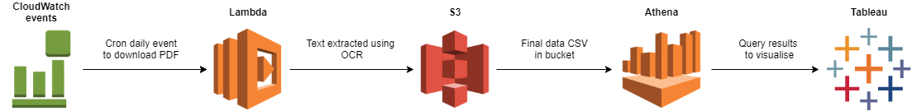
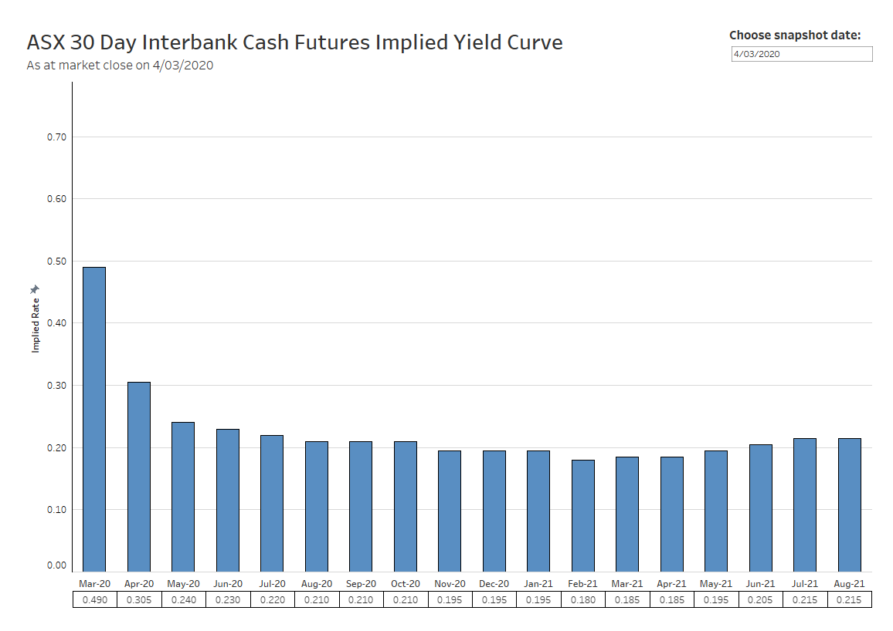

# RBA Implied Interest Rate DE Pipeline + Tableau Dashboard

Extracting, storing and visualising implied interest rate data based on *30 Day Interbank Cash Rate Futures* implied yield curve. Hosted in the AWS ecosystem with data extracted using Lambda, stored in S3 and queried with Athena.

## Architecture

The data is sourced from the Cash Rate Futures Yield Curve as provided by the ASX in PDF form (https://www.asx.com.au/data/trt/ib_expectation_curve_graph.pdf). This yield curve is derived from the market prices of 30 day interbank cash futures, where market participants trade based on what they believe the RBA cash rate will be at a certain point in time.

## Infrastructure

Hosted in AWS with the following resources:

**CloudWatch:**

- Automate the Lambda process with a daily run at 7pm AEST.

**Lambda:**

- One function to download the PDF and write it to S3, triggered daily at 7pm AEST.
- One function to extract the rate image from the PDF, triggered by an S3 PutObject event with prefix `/pdfs/` and suffix `.pdf`
    - This function uses the command line tool `pdfimages` from the `poppler` library.
- One function to run OCR on the image, verify integrity of the data and write to S3, triggered by an S3 PutObject event with prefix `/pngs/` and suffix `.png`
    - The OCR is performed with Tesseract after preprocessing (cropping and filtering) using OpenCV.
    - The final data is written to S3 with the snapshot date under `/csvs/`

**S3:**

- Bucket to host the PDFs, PNGs and CSVs.

**Athena:**

- Create an external table pointing to `s3://{bucket}/csvs`

| snapshot_date | futures_date | implied_rate |
|---------------|--------------|--------------|
| 2020-12-27    | 2021-01-01   | 0.4          |
| 2020-12-27    | 2021-02-01   | 0.5          |
| ...           | ...          | ...          |

**Tableau:**

- Dashboard connected to Athena with a custom user created in IAM with read-only Athena access.
- Tableau Public cannot host external data connections, so the dashboard with a data snapshot at time of publishing is available here:
    - https://public.tableau.com/profile/jacob.salway#!/vizhome/ASXImpliedYieldCurve/ASXImpliedYieldCurve

## Deployment

The Lambda functions were written with the Serverless framework for easy deployment to AWS. Historical PDFs from this year and last year were manually added to the bucket for processing.

## Lessons and points

* Historical PDFs are not publicly available so I cannot backfill data. The current historical data I have was from a Bash script that crawled the PDF with a Cron job for a period earlier this year and late last year.
* For the Tableau dashboard to have a live connection, I would need to host my own Tableau server or possibly Tableau Online, which is not economically feasible for a small project like this.
* I'm not confident that the three Lambda function split or my code quality is production worthy. Having separate functions made it easier to debug in CloudWatch logs.
* Deploying using Serverless takes a while as it needs to inject the dependencies and OpenCV is a large library. I tried to put these packages into Lambda Layers to speed up deployment but they were larger than the 250 megabyte limit.
* I did not set up any local emulation or tests for the functions. I have some small data integrity tests to make sure badly formatted data doesn't end up in Athena but these don't feel extensive enough. Some of my function testing involved dropping PDFs into S3 and watching CloudWatch logs but this process is ugly and I'm sure there's a better way to debug/develop.
